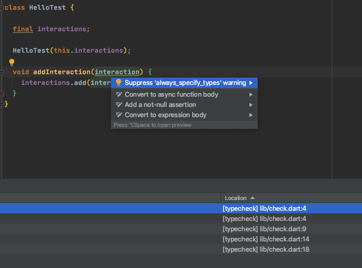
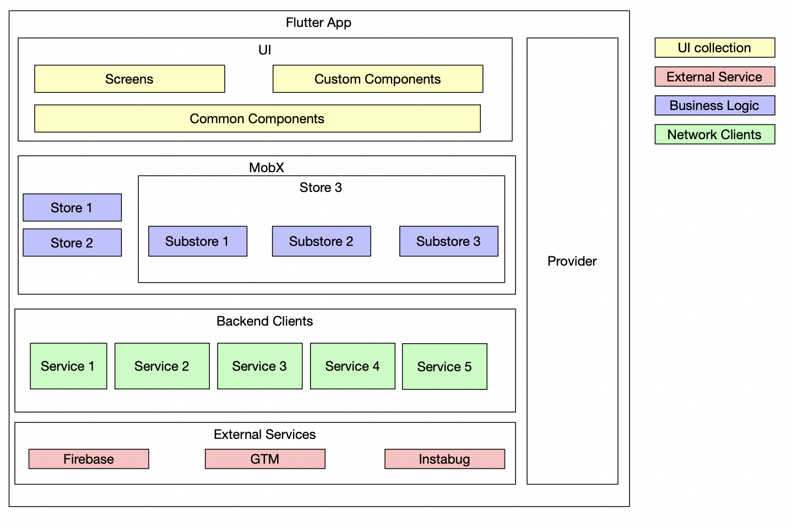

slidenumbers: true
autoscale: true
build-lists: true
slide-transition: true

# Fried Flutter: 
## preparing Flutter for commercial development


---

# [fit] Vladimir Ivanov

* Solution Architect @ EPAM Systems
* Experienced in Android, React-Native & Flutter


---

# Today we

- Know about Quality Standards in EPAM
- Know the project
- Face the issues
- Make the conclusions

---

# Engineering Excellence in EPAM

* Unified Code Style
* Static analysis
* Unit tests
* Tests coverage 
* Quality Gates


---

# Our project

- Innovative way of learning English.
- AI to help learning

---

# Project Specifics

- High number of integrations
- The initial team was not familiar with Flutter, only React-Native

---

# Project Structure

---


---


---

# What we faced

* Relied on default code style/static analysis
* Struggled with code generation
* Struggled with test runs for different modules


---

# Case #1
## Type system and code analysis 

---

# Dart & Type System

> The Dart language is type safe: it uses a combination of static type checking and runtime checks to ensure that a variable’s value always matches the variable’s static type, sometimes referred to as sound typing. 
-- https://dart.dev/guides/language/type-system

---

## But nothing by default 

---

```dart

void printInts(List<int> a) => print(a);

void main() {
  var list = [];
  list.add(1);
  list.add('2');
  printInts(list);
}

```

---


---


---

```sh

flutter analyze
Analyzing typecheck...                                                  
No issues found! (ran in 2.1s)


```

---

```

Unhandled exception:
type 'List<dynamic>' is not a subtype of type 'List<int>'


```

---

```dart

class HelloTest {

  final interactions;

  HelloTest(this.interactions);

  void addInteraction(interaction) {
    interactions.add(interaction);
  }
}

```

---


---



---

```yaml

analyzer:
  strong-mode:
    implicit-dynamic: false

```

---


---

# Case #1 - conclusions

* Use analysis_options.yaml from the beginning
* Configure it according your needs

---

# Case #2
## Code generation

---



---

## The problem

##[fit] 5+ services
##[fit] 50+ types for the service 

---

# OpenAPI

> The OpenAPI Specification (OAS) defines a standard, language-agnostic interface to RESTful APIs which allows both humans and computers to discover and understand the capabilities of the service without access to source code, documentation, or through network traffic inspection

-- https://swagger.io/specification/

---

# OpenAPI 

```yaml

{
  "/pets": {
    "get": {
      "description": "Returns all pets from the system that the user has access to",
      "responses": {
        "200": {          
          "description": "A list of pets.",
          "content": {
            "application/json": {
              "schema": {
                "type": "array",
                "items": {
                  "$ref": "#/components/schemas/pet"
  }}}}}}}}
}


```

---


```yaml
components:
  schemas:
    GeneralError:
      type: object
      properties:
        code:
          type: integer
          format: int32
        message:
          type: string

```

---

# Code generation with OpenAPI

[.code-highlight: 1]
[.code-highlight: 2]
[.code-highlight: 3]
[.code-highlight: 4]

```sh

java -jar openapi-generator-cli-4.3.1.jar generate 
	-i openapi.yaml 
	-g dart-dio 
	-o newversion

```

---

# Generation output

---


---

# Expectation

* single "Make it perfect" button

---

# Reality

* Buggy generators
* Developers have to patch buggy code 
* Developers have to redo patches after openapi.yaml update

---


---

# Case #2 - conclusions

* Try to avoid codegen
* Otherwise, automate it

---

# Automating openapi[^2]

* Download jar/install through npm
* Download openapi.yml
* Generate the files
* Patch imports and formatting
* Run build_runner build

[^2]: https://vvsevolodovich.dev/working-with-openapi-in-flutter-fully-automatically/

---

# Case #3 
## Tests

---

| Fluttter | Dart |
| --- | --- |
| `flutter test` | `flutter pub run test ./test` | 

---

# Tests

* flutter test doesn't run tests for submodules(in comparison with 'pub get') :thumbsdown:
* Separate code coverage :thumbsdown:
* Code coverage requires additional steps :thumbsdown:

---

# Coverage

* Generated as lcov.info
* Accepted by Github/Gitlab, not the bitrise
* Html report shows the coverage
* Code coverage should not drop(we have ~45% now)
* Coverage doesn't work for branches and functions


---


---

# How to generate coverage report and check it

[.code-highlight: 1-2]
[.code-highlight: 3-4]
[.code-highlight: 5-7]
[.code-highlight: 8-9]
[.code-highlight: all]

```sh

// install junit 
flutter "pub" "global" "activate" "junitreport"
// execute tests and convert the results
flutter "test" "--machine" | tojunit "--output" "./junit_results.xml"
// exclude the files
flutter pub run remove_from_coverage -f coverage/lcov.info -r \
 '.g.dart,lib/widgets/*,lib/screens/*'
// Generate report 
genhtml -o coverage/html coverage/lcov.info
// Check coverage
flutter pub run check_coverage -f coverage/lcov.info --min-line-coverage 45
```
---

## You need check_coverage[^3]

[^3]: we wrote it and plan to share

---

# Tightening the feedback loop

* CI for tests, code coverage, static analysis and Android/iOS builds :thumbsup:
* It takes up to 30 :thumbsdown:

---

# Git hook

---

[.code-highlight: 1]
[.code-highlight: 2-4]
[.code-highlight: 6-8]
[.code-highlight: all]

```sh

./tools/flutter_analyze.sh
if [ $? -ne 0 ]; then
  exit 1
fi

flutter test
if [ $? -ne 0 ]; then
  exit 1
fi

flutter format

```

---

# Case #3 - conclusions

* Check code coverage
* Check the coverage is not dropping
* Use git hooks for faster feedback 

---

# Case #4
## supporting different envs

---

# Supporting different envs

* You have to test the app against different envs
* Require different configs for analytics/crash reporting

---

# Expectations

Flavors will solve the problem

---

# Reality

Configuring flavors is a pain for iOS

---

# Android

* Add flavor to build.gradle
* Add a folder to src
* Done


---

# iOS

* Clone the target
* Clone the scheme
* Clone configurations
* Ensure, the scheme is named in Upper-case
* Ensure, the scheme is pointing to a proper configuration
* Ensure, the scheme is shared в Runner.xcproject(не воркспейс!)
* Ensure, the configuration for all targets bundle id & provisioning profile are set
* Check through flutter build ios --flavor=<flavor-name>


---

# Case #4 - conclusions

* There is --dart-define, use it if you have to change only api url
* Otherwise flavors, see the checklist

---

# What we knew today

* How to configure code-style & typisation
* How to work with code generation
* How to work with tests and code coverage
* How to configure different environments

---

# Conclusions

* Flutter is ready for commercial development
* It can be adjusted for high quality standards
* More info in my twitter and my blog!

---

# [fit] Vladimir Ivanov

* https://vvsevolodovich.dev :pencil:
* https://twitter.com/vvsevolodovich :bird:


