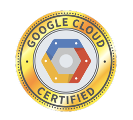
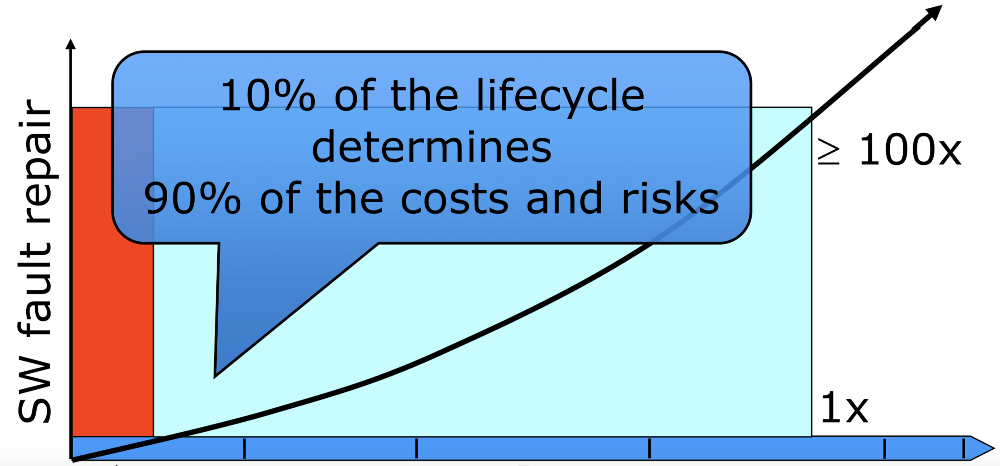
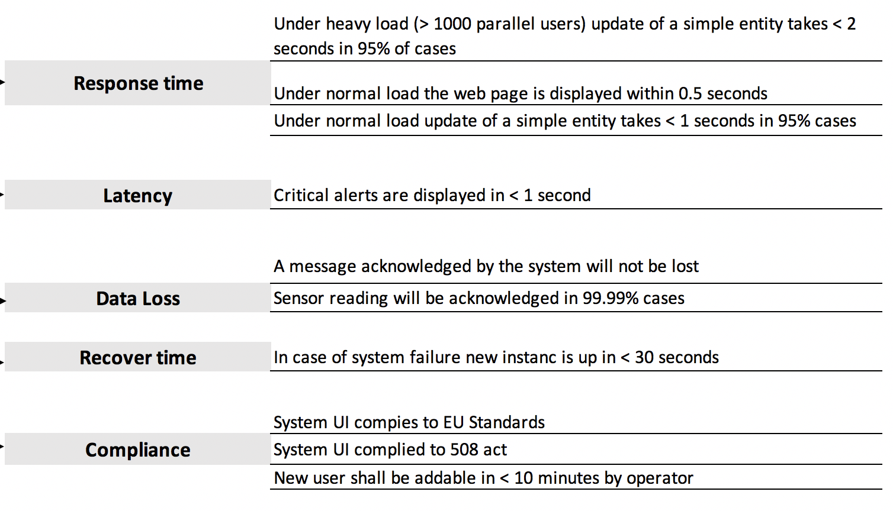

footer: EPAM Systems
slidenumbers: true
slidecount: true
autoscale: true
build-lists: true

---

# Disclaimer

Everything presented here is a product of production experience and research findings and provided as is. However, you can use it as we did. 

---

# About me

* Vladimir Ivanov - Lead Software Engineer
* Primary Skill: Android
* React Native Experience > 2 year
* Doing some Solution Architecture from time to time
* Certified Google Cloud Architect

---

[.build-lists: false]

# About me

* Vladimir Ivanov - Lead Software Engineer
* Primary Skill: Android
* React Native Experience > 2 year
* Doing some Solution Architecture from time to time
* Certified Google Cloud Architect

---

# Let's get to know each other!

---

---

# RFI

## Request for information

---

# RFI

* Answer the questions
* Contact the architects of related fields
* Perform the required research

---

# RFP

## Request for proposal

---

# RFP

* Understand the business value 
* Create a solution architecture
* Understand which teams are necessary to implement that solution 
* Come up with the resource plan

---

---

# Discovery

---

# Requirements gathering

* Functional
* Non-functional
* Constraints

---

# Functional requirements!

* The system should allow an administrator to login
* The system should show the list of users

---

# Non-functional requirements

* The application should use TLS 1.2 for all connections involving user-data
* The application should open the page under 0.5 second
* The application should be available 23 hours per day 

--- 

# Constraints

* The app should be deployed to customers' Azure cloud
* The app should implement 152 federal law

---

# Some of them will change the architecture of the solution.

---

# Every additional 9 of availability doubles the complexity of a target system.

---

---

# Source of requirements

* Stakeholders

---

Stakeholders are the people who have an interest in the project

* Customer business representatives
* Delivery organization business representatives
* Technical folks from both sides
* End-users
* Competitors

---

## In order to gather requirements you need to talk to stakeholders. 

## The stakeholders identification is one of the main responsibilities of a Solution Architect.

---

# What’s an architecture? 

The set of structures needed to reason about the system, which comprises software elements, relations among them, and properties of both. [^2]

[^2]: 
 	Software Architecture in Practice, 3rd Edition, Bass, Clements, Kazman, Addison-Wesley

---

# What the hell it means? 

* Architecture is a key to the system properties, an end user is concerned about
* Or product owner thinks so
* There are no bad or good architectures; there are ones that fit the target system properties

---

# ASRs

## Target system properties which affects architecture are unsurprisingly called architecturally significant requirements.  

---

# How to identify ASR? 

* From requirements documents
* By interviewing stakeholders
* By understanding the business goals
* Utility tree!

---

# Utility tree

---

---

---

---

# How to document architecture? 

* Non-formal notations with general purpose diagramming
* Semi-formal notations with standardized notation
* Formal notations with precise semantics

---

---

---

# Documenting the architecture is the third most important activity for an SA.

---

---

# Construction

* Bootstrap the development
* Define and setup quality gates
* Create PoCs 
* Share knowledge

---

---

# Transition

* To production
* To other team

---

# So...

The person who identifies stakeholders, gathers ASRs, builds the architecture, shares it and bootstraps some of the systems components is usually called Solution Architect.

---

# In EPAM

Solution Architect:

* Practical experience with 10+ projects in relevant engineering domain.

* Good knowledge of architectural theory out of primary technology domain context bounds.

* Ability to identify stakeholders and adopt communication style to particular role (effectively communicate with peer client architects and management). 

---

# Links

* Books is Software Architecture:
	https://medium.com/@nvashanin/books-in-software-architecture-6ad974e524ce
* Amazon Cloud Architect Associate:
	https://www.udemy.com/aws-certified-solutions-architect-associate/
* Google Cloud Architect Professional:
	https://www.coursera.org/specializations/gcp-architecture

---

